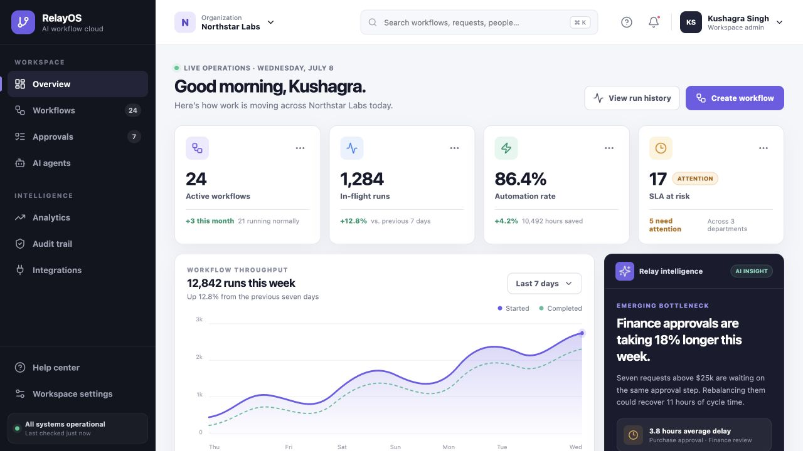
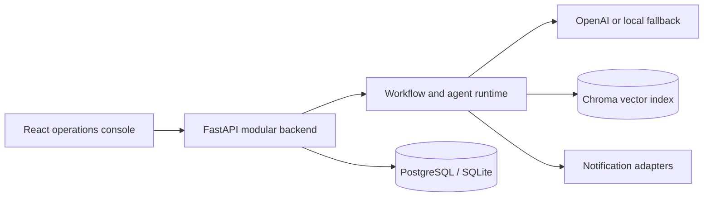

# RelayOS — AI Workflow Cloud

RelayOS is an interview-ready enterprise automation platform that combines workflow operations, AI-assisted decision support, human approvals, document intelligence, agent configuration, and auditable execution in one repository.

The project is deliberately built as a modular monolith first: it is easy to run and reason about locally, while its boundaries can be extracted into services when scale or team ownership justifies that move.

## Product preview



## Product experience

The React command center includes:

- Multi-tenant organization context and enterprise navigation.
- Live workflow KPIs, throughput trends, SLA risk, and automation-rate reporting.
- Human approval queue with owners, due times, and risk states.
- Active workflow portfolio with run volume, success rate, and service health.
- AI-generated bottleneck insight with a concrete remediation opportunity.
- Responsive desktop, tablet, and mobile layouts with accessible controls.

The FastAPI service includes:

- PDF/text document intake and extraction.
- Deterministic HR, finance, legal, and support classification.
- Structured field extraction, summaries, action items, and queue routing.
- Optional OpenAI summaries with a deterministic local fallback.
- PostgreSQL/SQLite persistence, workflow logs, retries, and agent configuration.
- Chroma-backed document indexing when the optional vector runtime is available.
- Webhook and simulated email, Slack, and Teams notification adapters.

## Architecture



This repository keeps product and backend boundaries explicit without pretending that a local portfolio project needs dozens of empty microservices. The next production evolution is a tenant-aware workflow engine with versioned definitions, durable human tasks, a transactional outbox, and background workers.

## Technology

- Frontend: React 18, Vite 8, Lucide icons, handcrafted responsive CSS.
- Backend: Python 3.12, FastAPI, SQLAlchemy, Pydantic, LangGraph, ChromaDB.
- Data: PostgreSQL in Compose; SQLite for a zero-config backend run.
- Infrastructure: Docker Compose and GitHub Actions/Pages.

## Run the complete stack

```bash
cp .env.example .env
docker compose up --build
```

- Web app: `http://localhost:5173`
- API: `http://localhost:8000`
- OpenAPI: `http://localhost:8000/docs`

## Run the web app

```bash
cd frontend
npm ci
npm run dev
```

Production validation:

```bash
npm run build
```

## Run the API

```bash
cd backend
python3 -m venv .venv
source .venv/bin/activate
pip install -r requirements.txt
uvicorn app.main:app --reload
```

The API uses SQLite by default. Set `DATABASE_URL` to connect PostgreSQL. Add `OPENAI_API_KEY` only when model-backed summaries are desired; the application remains usable without paid services.

## Repository map

```text
ai-agent-workflow-platform/
├── frontend/              RelayOS operations console
├── backend/app/           API, agents, persistence, and adapters
├── backend/tests/         Deterministic workflow tests
├── docker-compose.yml     Local PostgreSQL + API + web stack
└── .env.example           Runtime configuration contract
```

## Verification

The frontend is validated with a production Vite build. Backend modules are syntax-compiled and the deterministic agent logic has unit tests in `backend/tests`.

## Portfolio discussion points

- Why a modular monolith is the right starting boundary.
- How to add tenant isolation, RBAC/ABAC, and immutable audit history.
- How transactional outbox and idempotency make event-driven execution reliable.
- Where Kafka, Redis, object storage, and search become justified.
- How deterministic fallbacks improve cost, testability, and resilience around AI.
- How workflow versioning, retries, timers, escalation, and human tasks can evolve independently.

## Security note

The current backend is a local portfolio implementation, not a production identity perimeter. Before an internet-facing deployment, add authenticated tenant context, role/attribute authorization, upload limits and malware scanning, SSRF-safe webhook policy, encrypted secrets, database migrations, and provider-backed notifications.
